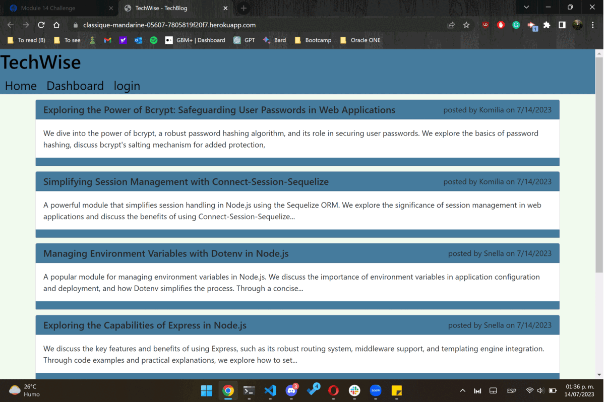

# M14C TechBlog ECR

## Description

A back end for an e-commerce site. From a working Express.js API to configure it to use Sequelize to interact with a MySQL database.
This project let the user GET, POST, PUT and delete data from the database. 

A fullstack blog site CMS-style where developers can publish their blog posts and comment on other developers’ posts as well.

## Table of Contents
- [ Walkthrough ](#walkthrough)
- [ Instalation ](#instalation)
- [ Usage ](#usage)
- [ License](#license)
- [ Contributing](#Contributing)
- [ Test ](#test)
- [ Questions ](#questions)

## Walkthrough

The following gif demonstrates the functionality of the application: 

You can see the [deployed page here.](https://classique-mandarine-05607-7805819f20f7.herokuapp.com/)

## Instalation

To install necessary dependencies, run the following command:

> npm i

> npm run seed

>npm start

## Usage

You can use the [deployed page](https://classique-mandarine-05607-7805819f20f7.herokuapp.com/) or clone the repository in your own computer, if so please follow the instalation process. 

  
## License
    
This project is licensed under the following license:

## Contributing

This repository is open source and contributions are welcome. If you have any ideas for improvements, please feel free to open an issue or submit a pull request.

## Questions

If you have any questions about the repo, open an issue or contact me directly at [cruz.rosales.ernesto@gmail.com](mailto:cruz.rosales.ernesto@gmail.com). You can find more of my work at [neto1895](https://github.com/neto1895)

